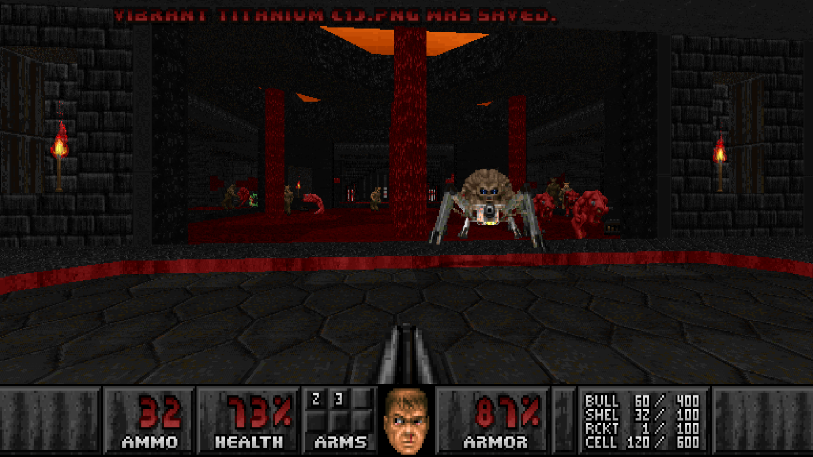

# VanillaPSX by DRON12261

# STATUS: ✅RELEASED

**VanillaPSX** is an audio-visual mod for near-vanilla ports that brings the Doom PSX aesthetic to PC Doom as much as possible.

The mod replaces all sprites, sounds (95% in high quality, thanks to Doom 64 Remastered), menu and interface graphics.

There is an additional addon that replaces the game's palette with one that is closer to Doom PSX, but it is not recommended to include it together with WAD, which contain their own palette.

The mod does not contain DEHACKED files, which means it does not affect gameplay or balance and will not conflict in any way with other WADs that may contain their own DEHACKED file.

The mod is compatible with most ports except Chocolate Doom and DOS. At a minimum the following ports have been tested by me:
- DSDA
- prBoom+
- ZDoom
- GZDoom
- Doom Retro
- Woof!
- Nugget Doom
- Cherry Doom
- Rude Doom
- Eternity Engine
- etc.

If you need assets to create a Doom PSX-inspired map, feel free to use VanillaPSX and include it in your wad/pk3/pke, making sure to specify credits beforehand.

### Download - [Latest Release - VanillaPSX v5](https://github.com/dron12261games/MOD-VanillaPSX/releases/download/v5/VanillaPSX.V5.by.DRON12261.WAD)
### Download - [Latest Release - VanillaPSX Pallete Addon](https://github.com/dron12261games/MOD-VanillaPSX/releases/download/v5/VanillaPSX.Pallete.Addon.wad)

# CREDITS
**Compiled/converted by DRON12261**

Resources taken from:
- DOOM PSX
- DOOM 64 REMASTERED
- DOOM PSX TC
- DOOM PSX GEC Master Edition
- DOOM PSX for Vanilla Doom
- PSX DOOM: The Forgotten Chapter by Dantosking

Special Thanks to lafoxxx [B0S] for helping me with some interface graphics

# Screenshots:
Screenshots were taken in different ports (1 - Rude Doom, 2 - DSDA, 3 - GZDoom, 4 - Doom Retro, 5 - Eternity Engine, 6,7 - prBoom+, 8 - Nugget Doom)

